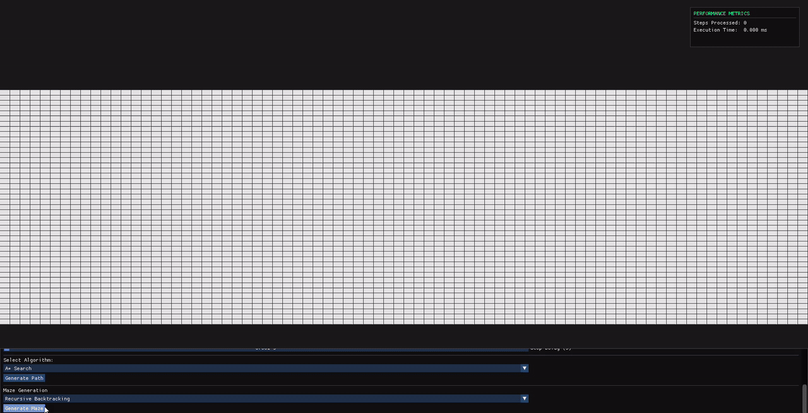

# Pathfinding & Maze Visualizer (C++)

An interactive tool built with C++, OpenGL, GLFW, and Dear ImGui to visualize how different pathfinding and maze generation algorithms work in real-time.

This project allows you to draw your own obstacles, place weighted terrain, and watch step-by-step as various algorithms navigate the grid to find the most efficient path.

## Algorithms
### Pathfinding & Graph Search
- [x] **Breadth-First Search (BFS):** Guarantees the shortest path on unweighted grids.
- [x] **Depth-First Search (DFS):** Explores as far as possible along each branch before backtracking.
- [x] **Dijkstra’s Algorithm:** Finds the shortest path in weighted graphs.
- [x] **A\* Search:** Uses heuristics to optimize pathfinding speed and efficiency.
- [x] **Bidirectional BFS:** Searches from both start and end points simultaneously to find a path faster.

### Maze Generation
- [x] **Recursive Backtracking:** A randomized DFS approach that creates long, winding paths.
- [x] **Prim’s Algorithm:** Gradually expands from a starting cell to create a maze.
- [x] **Kruskal’s Algorithm:** Uses randomized wall removal to create a unique maze structure.

## Features
* **Interactive Grid:** Draw walls and place weighted nodes directly onto the grid.
* **Weighted Terrain:** Add "Mud" or "Sand" to see how algorithms adjust for higher-cost paths.
* **Playback Controls:** Pause, resume, and adjust the visualization speed mid-run.
* **Instant Mode:** Toggle instant generation to skip the animation and see the final result immediately.
* **Performance HUD:** View real-time metrics including step counts and execution time.

## Tech Stack
* **Language:** C++
* **Build System:** CMake
* **Windowing & Input:** GLFW3
* **Graphics API:** OpenGL
* **User Interface:** Dear ImGui

## Architecture
The project is designed to separate the algorithm logic from the rendering loop:

* **Iterative Execution:** Algorithms are implemented as step-functions, allowing the UI to remain responsive and the speed to be adjusted during execution.
* **Shared Grid State:** All pathfinders and maze generators operate directly on a unified cell and grid structure. This allows the application to swap and run any algorithm interchangeably without changing the underlying grid code.
* **Algorithmic Efficiency:** Individual algorithms utilize data structures tailored to their specific logic, such as priority queues for weighted pathfinding or Disjoint Set Union for Kruskal’s maze generation.